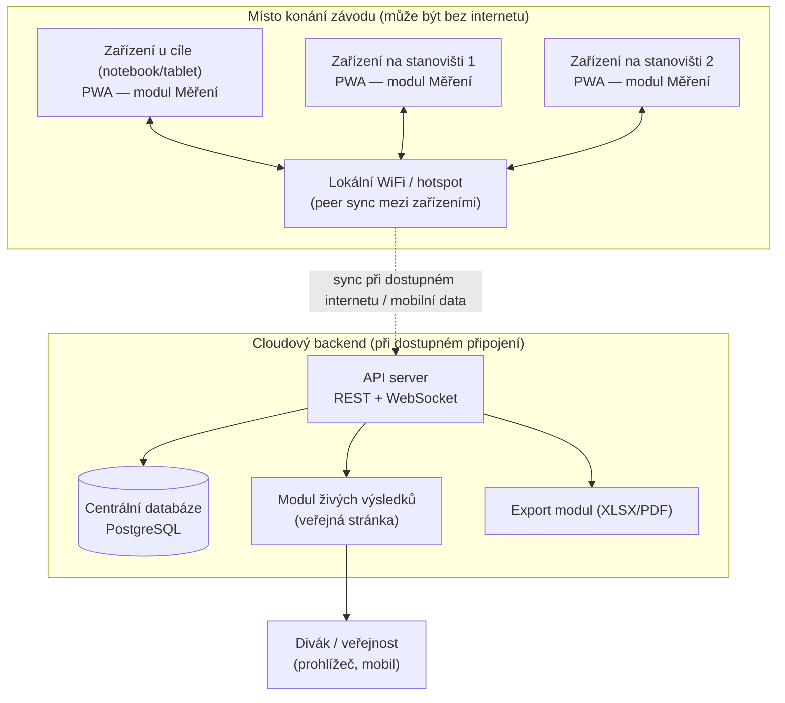
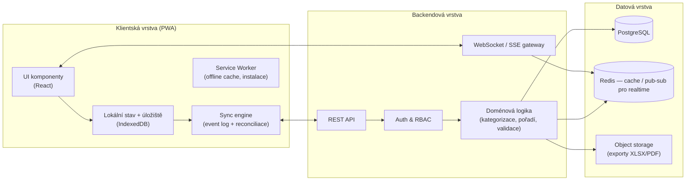
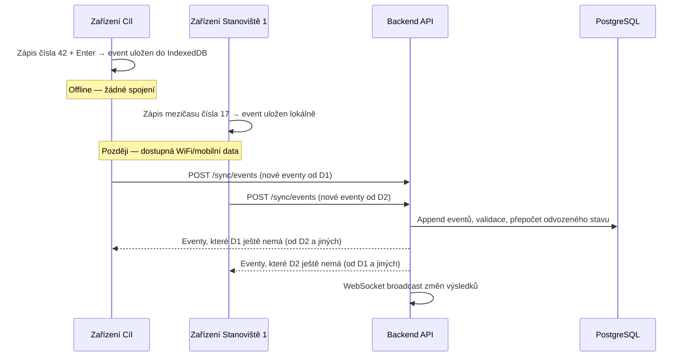
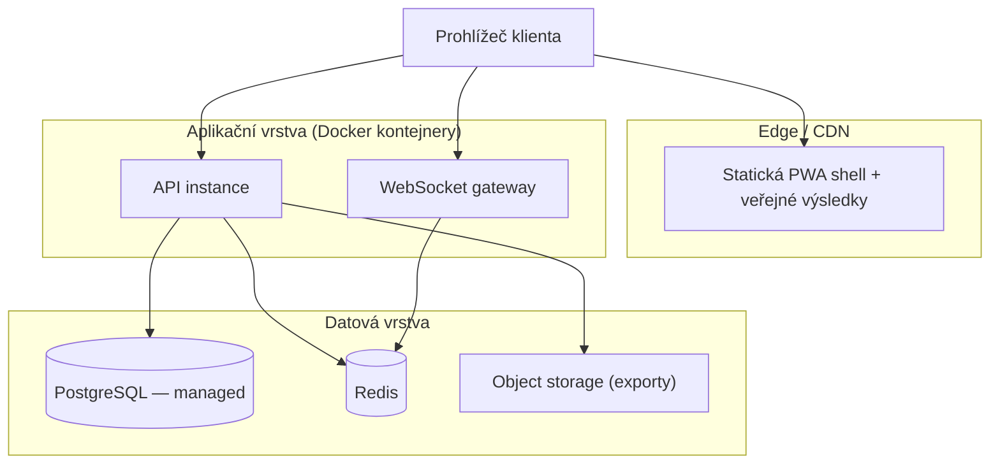
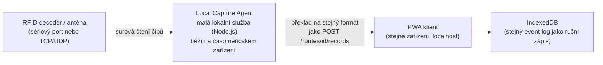
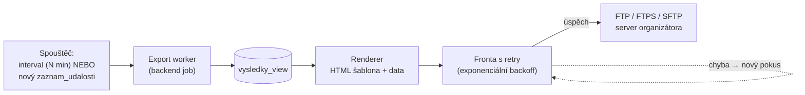

# 3. Architektura nového systému

## 3.1 Cíle modernizace

1. Zachovat to, co funguje: jednoduchost workflow "číslo + Enter", auditní log, robustní offline chování.
2. Odstranit platformní závislost na Windows/Accessu → webová aplikace přístupná z prohlížeče na jakémkoli zařízení.
3. Umožnit skutečnou spolupráci více stanovišť v reálném čase namísto ručního kopírování souborů.
4. Zachovat odolnost vůči výpadku internetu v místě konání závodu — klíčový požadavek, nejde slevit ve prospěch "cloud-only" řešení.
5. Živá publikace výsledků online bez manuálního exportu/uploadu.
6. Moderní řízení přístupu (role: organizátor, časoměřič, stanoviště, čtenář výsledků) a zálohování v cloudu.

## 3.2 Architektura na vysoké úrovni

Vzhledem k tvrdému požadavku na spolehlivost bez internetu na místě volíme **offline-first / lokálně-synchronizovanou architekturu**, ne čistě cloudovou aplikaci závislou na neustálém připojení.

**Klíčová myšlenka:** každé zařízení v terénu běží jako **PWA** (Progressive Web App) s lokální databází (IndexedDB) a funguje plně offline. Zařízení se mezi sebou i s cloudem synchronizují, jakmile je dostupné jakékoli spojení (lokální WiFi hotspot mezi stanovišti, nebo mobilní data/internet směrem k centrální databázi). Tím se nahrazuje dnešní "kopírování souboru přes USB" automatickou a průběžnou synchronizací, ale princip "funguje to i bez internetu" zůstává zachován.

## 3.3 Vrstvy systému

## 3.4 Klíčové moduly a mapování na use case

| Modul | Nahrazuje v Accessu | Poznámka |
|---|---|---|
| **Správa závodu** | formulář "Nastavení" | Web formulář — kategorie, číselné řady, typ startu |
| **Přihlášky** | ruční import | Import CSV/Google Forms, případně vlastní registrační formulář |
| **Zápis na místě** | formulář zápisu | Vyhledávání podle jména/klubu, offline na tabletu u stolu |
| **Měření (jádro)** | hlavní formulář časomíry | Numpad optimalizovaný pro rychlost, identické chování na PC i tabletu |
| **Kontrolní stanoviště** | kopírování `!!záznamy` přes USB | Stejná aplikace na libovolném zařízení, auto-sync místo USB |
| **RFID/čárové kódy** | externí HW řešeno mimo Access | Web Serial/Web Bluetooth API nebo externí zařízení přes API |
| **Kdo běží / DNF** | lokální dotaz na jednom PC | Živě aktualizovaný přehled dostupný všem oprávněným zařízením |
| **Opravy a audit** | log v tabulce | Webové rozhraní s filtrováním, stejná logika zachování času |
| **Výsledky a exporty** | ruční export/tisk | Okamžitý přepočet, TOP3, XLSX/PDF, jedním klikem publikovatelná stránka |
| **Role a přístupy** | sdílené heslo na tabulku | RBAC, individuální účty, pozvánky e-mailem |

## 3.5 Synchronizační strategie (nejkritičtější technické rozhodnutí)

Nahrazuje dnešní ruční kopírování tabulky `!! záznamy` mezi stanovišti. Požadavky:

- Musí fungovat i když dvě zařízení zapíší nezávisle na sobě a spojí se až později (offline-first).
- Nesmí docházet k tichému přepsání/ztrátě záznamu — každý zápis časoměřiče je "posvátný".
- Konflikt (např. oprava stejného záznamu na dvou místech) musí být buď automaticky bezkonfliktně sloučen, nebo viditelně nahlášen k ručnímu rozhodnutí.

**Zvolený přístup: append-only event log + lokální reconciliace**

1. Každý zápis (`ZAZNAM` vznikl / `ZAZNAM` opraven / `START` zahájen / `ZAVODNIK` DNF) je **immutable event** s jednoznačným ID (UUID generovaným na klientovi), časovým razítkem a ID zařízení.
2. Klient ukládá eventy lokálně do IndexedDB ihned při vzniku (nikdy nečeká na síť).
3. Při dostupném spojení klient pošle nové eventy na server (`POST /sync/events`) a stáhne eventy, které ještě nemá.
4. Aktuální stav (např. "poslední hodnota čísla u záznamu X") je **odvozen přehráním eventů** seřazených podle logického (ne nutně nástěnného) pořadí — stejný princip jako dnešní auditní log, jen strojově konzistentní.
5. Skutečné konflikty (dvě různé opravy téhož záznamu z různých zařízení dřív, než se stihly synchronizovat) se neřeší tichým "poslední vyhrává", ale:
   - pokud jde o **opravu čísla při zachovaném čase** → poslední zápis podle serverového přijetí vyhrává, ale **obě verze zůstávají v logu** (nic se nemaže),
   - pokud jde o **nejednoznačnou kolizi** (např. stejné startovní číslo doběhlo na dvou stanovištích v témže kole) → záznam se označí `NEEDS_REVIEW` a zobrazí se organizátorovi k ručnímu rozhodnutí (obdoba dnešního "vlož 0 a oprav to později").
6. Tento model je v praxi jednodušší než plné CRDT struktury (např. Automerge/Yjs), protože doména je "z valné většiny append-only" (nová časová razítka vznikají, existující se upravují jen zřídka a v jasně definovaných situacích) — plná CRDT knihovna je zvažována jako budoucí vylepšení, ne nutnost pro MVP (viz [05-tech-stack.md](05-tech-stack.md)).

## 3.6 Realtime vrstva

- **WebSocket** kanál pro připojená zařízení organizátora/časoměřičů — okamžité promítnutí nových záznamů, přehledu "kdo běží", výsledků.
- **Server-Sent Events (SSE)** nebo cachovaná/edge stránka pro veřejné živé výsledky — vydrží nápor diváků bez zatížení hlavního API.
- Realtime vrstva je **doplněk**, ne závislost: pokud spojení chybí, aplikace funguje plně na lokálních datech a dožene stav při obnovení spojení (bod 3.5).

## 3.7 Nasazení (deployment)

Doporučeno nasazení na **managed platformu** (Render/Railway/Fly.io) nebo malý VPS s Dockerem — odpovídá provoznímu rozpočtu komunitních závodů (viz N10 v [02-requirements.md](02-requirements.md)). Podrobnosti technologií viz [05-tech-stack.md](05-tech-stack.md).

## 3.8 Multi-tenancy

Pokud má systém sloužit více organizátorům/klubům současně (F24), zavádí se `organizace` jako top-level entita, ke které se váže vše ostatní (závody, uživatelé, role). Izolace na úrovni řádků (row-level security v PostgreSQL) zajišťuje, že organizátor A nikdy neuvidí data organizátora B. V MVP lze začít v single-tenant režimu a rozšířit později bez zásadní změny datového modelu (viz [04-data-model.md](04-data-model.md)).

## 3.9 Local Capture Agent — napojení RFID decodérů (F22, N12)

Prohlížečové API (Web Serial, Web Bluetooth) jsou nedostatečná jako jediná cesta pro připojení profesionálních RFID decodérů: fungují jen v Chromiu, vyžadují explicitní gesto uživatele při každém párování, a řada decodérů (UHF čtečky na startu/cíli) komunikuje po **síti (TCP/UDP)**, ne přes USB/serial — to prohlížeč z bezpečnostních důvodů vůbec neumožní. Řešení, konzistentní s offline-first architekturou (§3.2–3.5):

- **Local Capture Agent** je malá doplňková služba (Node.js proces, distribuovaná jako jednoduchý instalovatelný balíček nebo součást PWA přes budoucí desktop wrapper), která běží přímo na časoměřičském notebooku/mini-PC vedle RFID decodéru.
- Naslouchá nativnímu protokolu decodéru (sériová linka, nebo lokální TCP/UDP socket — podle konkrétního výrobce čtečky) a **překládá každé přečtení čipu na stejnou strukturu záznamu**, jakou generuje ruční zápis "číslo + Enter" (viz `POST /routes/{id}/records` v [06-api-design.md](06-api-design.md)).
- Volá lokální endpoint PWA klienta (`http://localhost:<port>`) — záznam tak vstupuje do **stejného append-only event logu a stejné synchronizační pipeline** (§3.5) jako manuální zápis. Časoměřič nemusí nic přepínat, RFID a ruční zápis jsou jen dva rovnocenné vstupy do jednoho systému, a při výpadku RFID čtečky lze bez přerušení pokračovat ručně na stejné obrazovce.
- Agent je záměrně **hloupý a bezstavový** — neprovádí žádnou byznys logiku (kategorizace, výpočet pořadí), pouze převádí surová čtení na standardní event. Veškerá logika zůstává v PWA/backendu, agent lze tak snadno nahradit i pro jiný typ hardwaru (čtečka čárových kódů, jiný výrobce RFID) beze změny zbytku systému.
- Toto je vědomě odložená položka (Fáze 4, viz [10-roadmap.md](10-roadmap.md)) — pro MVP a i pro Fázi 2/3 postačuje ruční zápis; investice do konkrétního HW/protokolu dává smysl až po ověření základního systému v ostrém provozu. Podrobnosti hardwarových variant a provozní workflow párování čipů viz **[12-rfid-a-doporuceni.md](12-rfid-a-doporuceni.md)**.

## 3.10 Export a publikace výsledků na FTP/SFTP (F34–F37)

Na rozdíl od RFID (§3.9), toto **není** odložená položka — jde o přímou funkční paritu se starou Časomírou, kterou organizátor aktivně používal (potvrzeno reálnou FTP konfigurací v [11-legacy-schema-reference.md](11-legacy-schema-reference.md)), takže patří do MVP (F34, F35 jsou Must have v [02-requirements.md](02-requirements.md)).

- **Spouštěč** je konfigurovatelný na úrovni `publikacni_cil` (§4.10 v [04-data-model.md](04-data-model.md)): buď pevný interval v minutách (odpovídá legacy `autoexportmin`), nebo okamžitě po každém přijatém `zaznam_udalosti` typu `DOJEZD`/`OPRAVA` na dané události — u malého závodu (řádově desítky zápisů, viz objemy v [11-legacy-schema-reference.md §11.3](11-legacy-schema-reference.md)) je "export po každém zápisu" klidně reálná výchozí volba bez rizika přetížení.
- **Export worker** je samostatný proces/queue job v backendu (ne request-response cesta) — selhání FTP uploadu (výpadek hostingu, špatné heslo) nesmí nijak zpomalit ani ohrozit zápis měření, který zůstává nezávislý (stejný princip oddělení jako u realtime vrstvy, §3.6).
- **Fronta s retry** — na rozdíl od staré Časomíry, kde selhání FTP uploadu bylo tiché (žádná chybová hláška v UI, organizátor musel sám zkontrolovat výsledky na webu), nový systém neúspěšný pokus zopakuje (exponenciální backoff, např. 3 pokusy) a viditelně to promítne do `publikacni_cil.posledni_export_stav` v UI.
- **Renderer** generuje statickou HTML stránku ze stejného odvozeného stavu jako živá stránka výsledků (§3.6, `vysledky_view`) — jde o dva **výstupní formáty téhož zdroje pravdy**, ne dvě samostatně udržovaná data, takže nemůže dojít k rozjetí hodnot mezi "živou" a "FTP" verzí výsledků.
- Tento kanál je záměrně nezávislý na tom, jestli organizátor používá i vestavěnou živou stránku time-sys (F16) — řeší jiný problém: **publikaci na vlastní doméně/webu klubu**, kterou si organizátor typicky udržuje roky napříč ročníky závodu a nechce ji opouštět jen kvůli výměně časomíry.
