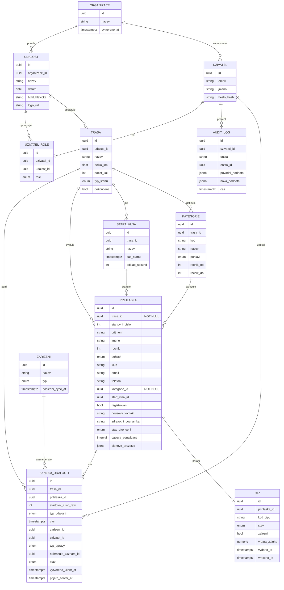

# 4. Datový model nového systému

Model vychází z reálného schématu staré aplikace ([11-legacy-schema-reference.md](11-legacy-schema-reference.md)), doplněný o entity, které starý systém řešil jen konvencí nebo vůbec (organizace, uživatelé/role, formální "událost" nad tratěmi, strukturovaný event log místo textového). Cílová databáze: **PostgreSQL** (zdůvodnění v [05-tech-stack.md](05-tech-stack.md)).

## 4.1 ERD — přehled

## 4.2 Klíčové designové rozhodnutí: `zaznam_udalosti` jako append-only event log

Toto je centrální tabulka celého systému (nahrazuje `tblZaznamy` + částečně `tblLogy` ze starého modelu) a zároveň nosič synchronizační strategie z [03-architecture.md §3.5](03-architecture.md#35-synchronizační-strategie-nejkritičtější-technické-rozhodnutí):

- **Nikdy se needituje, jen přidává.** Oprava čísla není `UPDATE` staré hodnoty, ale nový řádek `typ_udalosti = 'OPRAVA'`, `nahrazuje_zaznam_id = <id předchozího>`. Aktuální platná hodnota se odvozuje jako "poslední řádek v řetězci `nahrazuje_zaznam_id`".
- **`startovni_cislo_raw`** se ukládá vždy (i když se nepodaří napárovat na `prihlaska_id`) — přímý ekvivalent chování "neexistující/prázdné číslo → řádek s 0" ze starého systému (viz [01-analysis.md §1.10](01-analysis.md)), jen bez nutnosti fixního placeholder řádku v `prihlaska`.
- **`stav`** nabývá `OK` / `NEEDS_REVIEW` — druhá hodnota pro kolize při synchronizaci více zařízení (viz architektura).
- **`vytvoreno_klient_at` vs. `prijato_server_at`** — dvojí časové razítko: první je čas na zařízení v okamžiku zápisu (rozhodující pro výpočet výsledků — ekvivalent starého `datumcas`+`datumcasMS` triku, ale nativně přesný v PostgreSQL), druhý je čas přijetí serverem (pro diagnostiku synchronizace, ne pro výpočet výsledků).
- `typ_udalosti`: `START`, `DOJEZD`, `MEZICAS`, `OPRAVA`, `DNS`, `DNF`, `DQ`.
- `typ_opravy`: enum přímo navazující na starý číselník `tblZmenyZaznamu` — `ORIGINAL`, `PREPIS_POSLEDNIHO_RADKU`, `PREPIS_NULY_NA_CISLO`, `PREPSANE_CISLO`, `ZMENA_V_UPRAVACH` (viz [11-legacy-schema-reference.md](11-legacy-schema-reference.md)).

Výsledky (`GET /races/{id}/results`, viz [06-api-design.md](06-api-design.md)) se **počítají z `zaznam_udalosti` on-the-fly nebo do materializovaného view**, nikdy se needituje/needukládá zvlášť jako ve staré `tblVysledky` (typický Access anti-pattern "plochá tabulka jako cache tisku").

## 4.3 Role a přístup

`uzivatel_role` váže uživatele na konkrétní `udalost` s rolí:

| Role | Oprávnění |
|---|---|
| `ADMIN` | Správa organizace, všech událostí a uživatelů |
| `ORGANIZATOR` | Plná správa jedné události (tratě, kategorie, startovní listina, export) |
| `CASOMERIC` | Zápis do `zaznam_udalosti` (start, doběh, oprava) na přiřazené trati |
| `STANOVISTE` | Jako `CASOMERIC`, ale jen pro mezičasy na konkrétním kontrolním bodě |
| `VEREJNOST` | Jen čtení živých výsledků — bez účtu, přes veřejný odkaz (viz [08-security.md](08-security.md)) |

## 4.4 Klíčové indexy a integritní pravidla

- `prihlaska (trasa_id, startovni_cislo)` — `UNIQUE` (stejné pravidlo jako `tblStartovnilistina_startovnicislo_idx` ve starém systému, ale správně composite přes trať, ne globálně).
- `zaznam_udalosti (trasa_id, cas)` — index pro rychlé řazení/výpočet pořadí.
- `zaznam_udalosti (prihlaska_id)`, `zaznam_udalosti (startovni_cislo_raw)` — pro dohledání historie konkrétního závodníka/čísla.
- `cip (kod_cipu)` — `UNIQUE`.
- Cizí klíče `ON DELETE RESTRICT` na `trasa`/`udalost` (žádné tiché mazání historických dat závodu), `ON DELETE CASCADE` jen z `udalost → trasa` při explicitním smazání celé (nevyexportované) události v konceptu.

## 4.5 Odvozené (počítané) pohledy

| View | Účel | Nahrazuje |
|---|---|---|
| `vysledky_view` | Pořadí celkové, po kategoriích, TOP3, časová penalizace zohledněna | `tblVysledky`/`tblVysledkyTMP` |
| `kdo_bezi_view` | Startovní čísla s `START`, ale bez odpovídajícího `DOJEZD` v posledním kole a bez `DNF/DNS/DQ` | dotaz nad `tblStart`/`tblZaznamy` v Accessu |
| `audit_trail_view` | Sloučený pohled `zaznam_udalosti` (typ OPRAVA) + `audit_log` pro UI auditu | `tblLogy` (textový) |

## 4.6 Multi-tenancy (Should/Could have)

`organizace` je top-level entita. V PostgreSQL se izolace řeší přes **Row-Level Security (RLS)** s politikou `organizace_id = current_setting('app.current_org')`, nastavovanou middlewarem backendu po ověření JWT. V MVP lze RLS nasadit rovnou (nízké dodatečné náklady), i když je zpočátku jen jedna organizace — zamezí to nutnosti pozdější bolestivé migrace.

## 4.7 Co z legacy schématu záměrně nepřebíráme 1:1

Viz [11-legacy-schema-reference.md §11.4](11-legacy-schema-reference.md#114-mapování-starý--nový-model-přehled) pro kompletní mapovací tabulku. Shrnutí nejdůležitějších změn:

- Dual-timestamp ms-hack → jediný `timestamptz` s mikrosekundovou přesností.
- Plochá "cache" tabulka výsledků → odvozený view/materialized view.
- Textový, volně formátovaný log → strukturovaná `zaznam_udalosti` + `audit_log`.
- Chybějící entita nad tratěmi → nová `udalost`.
- Technické Access-specifické tabulky (`tblSloupce`, `tblLokalizace`, `tblImport*`) → standardní webové ekvivalenty (konfigurace UI v kódu frontendu, i18n framework, generický CSV/XLSX import modul, viz [05-tech-stack.md](05-tech-stack.md)).

## 4.8 Povinná pole při registraci: trasa a kategorie

`prihlaska.trasa_id` a `prihlaska.kategorie_id` jsou **`NOT NULL`** — na rozdíl od staré `tblStartovniListina`, kde `idvekovakategorie` byl nepovinný sloupec a v reálných datech se skutečně vyskytovaly řádky bez přiřazené kategorie (viz [11-legacy-schema-reference.md](11-legacy-schema-reference.md)). Důvod zpřísnění (požadavek F03 v [02-requirements.md](02-requirements.md)):

- Bez `trasa_id` nelze závodníka jednoznačně zařadit do `zaznam_udalosti` ani do výpočtu výsledků — u vícetraťové akce (viz [01-analysis.md §1.10](01-analysis.md), zjištění o "závodu" jako trati, ne akci) je volba tratě první a nezbytná otázka při registraci.
- Bez `kategorie_id` nelze dopočítat pořadí v kategorii ani TOP3 (F12) — chybějící kategorie byla v praxi zdroj ručních oprav po závodě.

Aplikační vrstva (ne jen databáze) kategorii **automaticky předvyplní** podle ročníku narození a pohlaví (stejná logika jako `vekod`/`vekdo` ve staré `tblVekovaKategorie`), ale UI vždy vyžaduje viditelné potvrzení hodnoty před uložením (viz mockup [07-ui-mockups.md §7.8](07-ui-mockups.md)) — uživatel nikdy neuloží přihlášku s prázdnou kategorií "omylem", ale zároveň může kategorii vědomě přepsat (např. závodník startující v jiné než "své" kategorii).

## 4.9 RFID čip — životní cyklus

Entita `cip` je rozšířená oproti staré `tblCipy` (`id, startovnicislo, cip` — jen prosté párování) o pole potřebná pro reálný provoz s fyzickými čipy jako spotřebním/vratným materiálem:

| Pole | Účel |
|---|---|
| `stav` | `PRIREZEN` / `VRACEN` / `ZTRACEN` / `ZALOZNI` — životní cyklus čipu v rámci jedné akce |
| `zalozni` | Příznak, že jde o náhradní čip vydaný za ztracený/nefunkční originál (bez ztráty historie měření na starém čipu) |
| `vratna_zaloha` | Částka vybrané vratné zálohy (běžná praxe u vícepoužitelných UHF čipů) |
| `vydano_at` / `vraceno_at` | Časové razítko výdeje a vrácení — podklad pro vyúčtování nevrácených záloh po závodě |

Podrobný návrh workflow párování, hardwarové varianty a doporučený "local capture agent" pro napojení RFID decodérů viz **[12-rfid-a-doporuceni.md](12-rfid-a-doporuceni.md)**.
