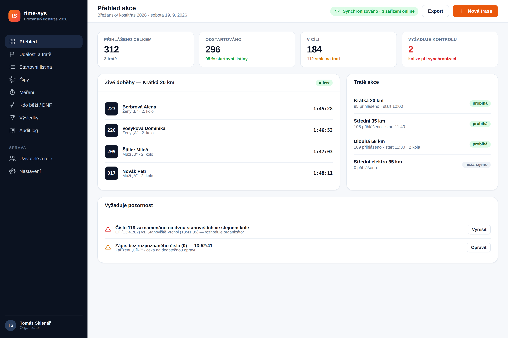
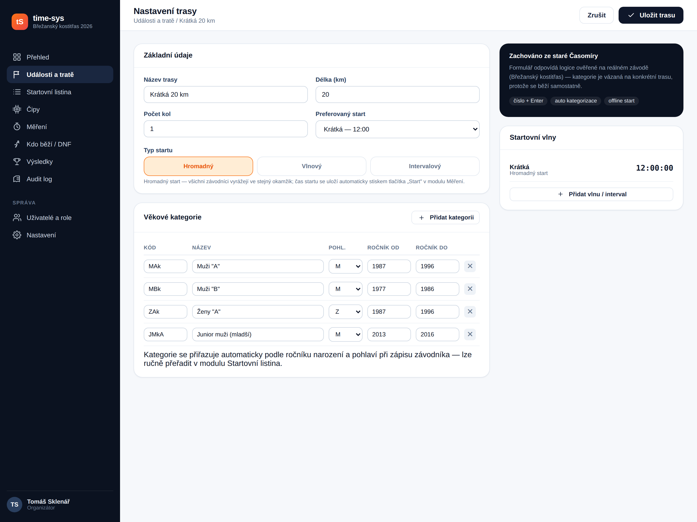
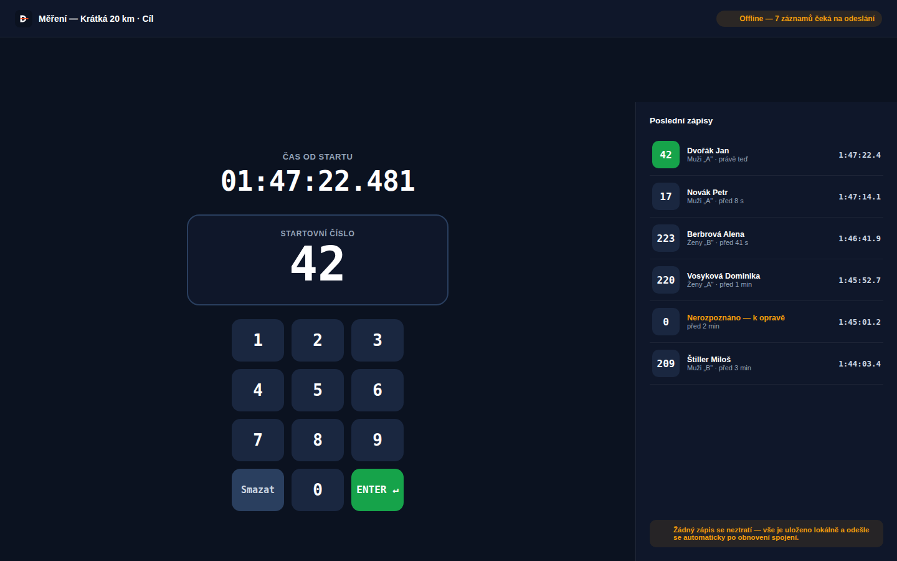
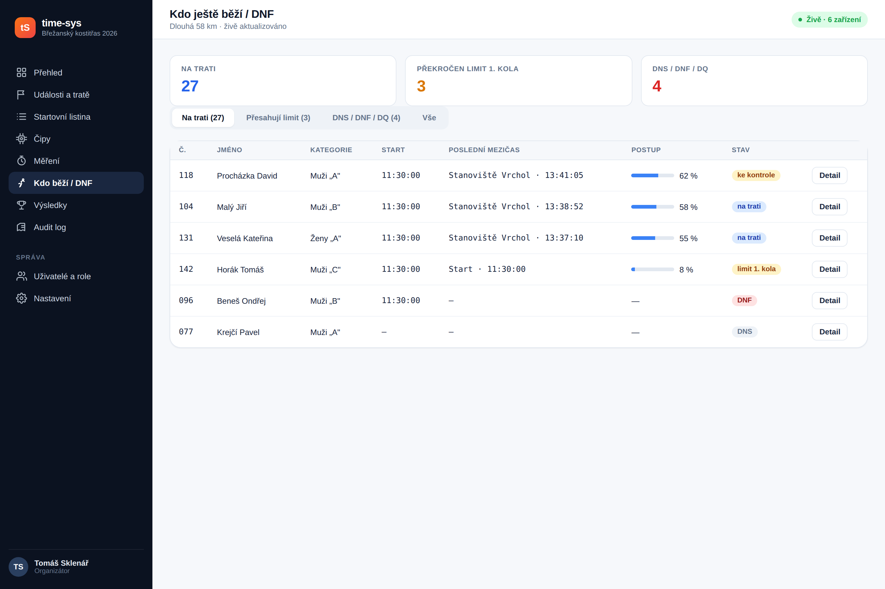
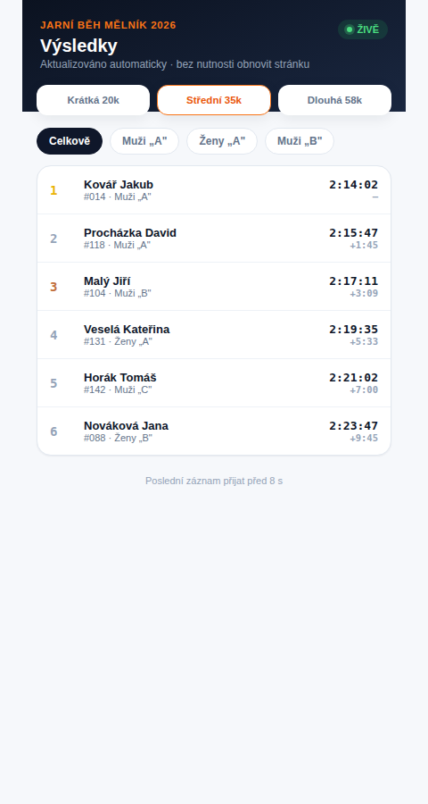
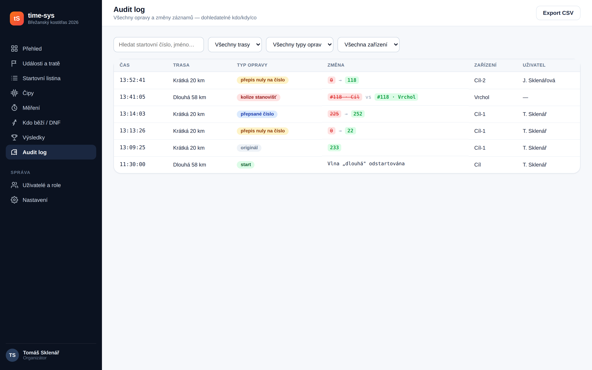
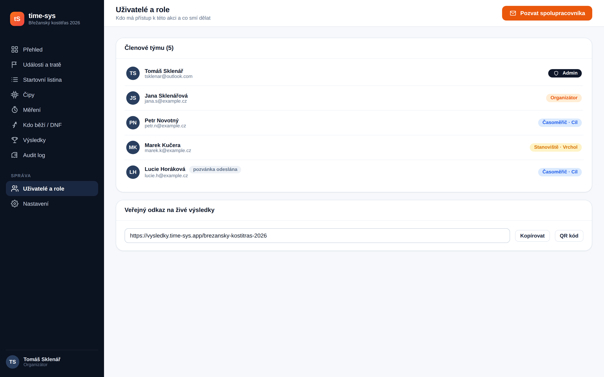
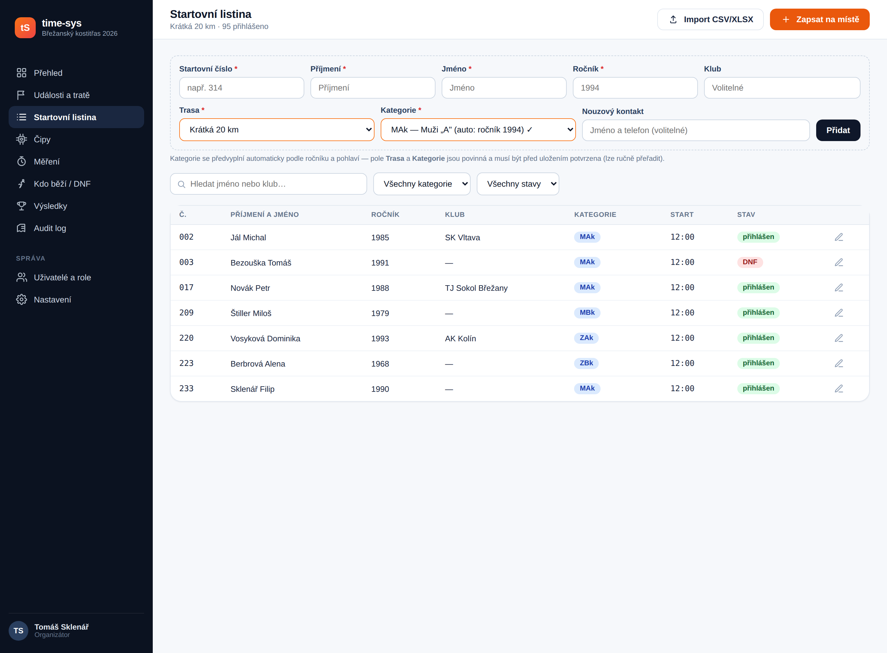
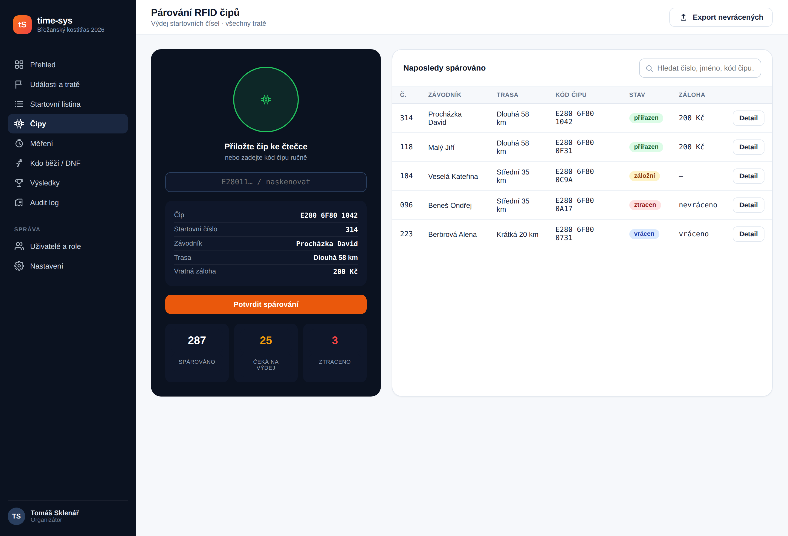

# 7. Návrh obrazovek (UI mockupy)

Statické mockupy klíčových obrazovek nové aplikace — vytvořené jako samostatné HTML/CSS soubory (zdroj v [`/design/mockups`](../design/mockups)) a vyrenderované do PNG přes Playwright/Chromium. Design systém (barvy, typografie, komponenty) je definován v [`shared.css`](../design/mockups/shared.css) a je sdílený napříč všemi obrazovkami pro vizuální konzistenci.

**Design principy:**
- Tmavá postranní navigace (orientace v modulech) + světlý obsah s vysokým kontrastem — čitelnost i na tabletu venku na slunci (N08 v [02-requirements.md](02-requirements.md)).
- `JetBrains Mono` pro všechny číselné/časové údaje (startovní čísla, časy, kódy) — jednoznačná čitelnost číslic pod tlakem.
- Barevná sémantika stavů: zelená = OK/live, oranžová/jantarová = vyžaduje pozornost, červená = kolize/chyba/DNF, modrá = informační.
- Modul Měření má **vlastní, minimalistický tmavý shell** bez postranní navigace — cílem je nulové rozptýlení časoměřiče, obrazovka slouží jedinému účelu.

## 7.1 Přehled organizátora (Dashboard)

Vstupní obrazovka po přihlášení organizátora. Ukazuje stav napříč tratěmi jedné akce, živé doběhy poslední aktivní trati a sekci **„Vyžaduje pozornost“** — přímé promítnutí konceptu `NEEDS_REVIEW` ze synchronizační strategie ([03-architecture.md §3.5](03-architecture.md)) a neresolvovaných zápisů čísla „0“ (viz [01-analysis.md §1.10](01-analysis.md)) do UI, aby organizátor o kolizích/chybách nemusel vědět z technického logu, ale viděl je jako běžnou pracovní frontu.

## 7.2 Nastavení trasy

Nahrazuje formulář „Nastavení“ ze staré Časomíry (F01, F02 v [02-requirements.md](02-requirements.md)). Výběr typu startu jako velké dotykové „pills" (hromadný/vlnový/intervalový), inline editovatelná tabulka kategorií se stejnou strukturou jako reálná `tblVekovaKategorie` (kód, název, pohlaví, ročník od–do — viz [11-legacy-schema-reference.md](11-legacy-schema-reference.md)), postranní panel se startovními vlnami.

## 7.3 Měření — jádro aplikace

**Nejdůležitější obrazovka celého systému** — přímý ekvivalent hlavního formuláře staré Časomíry (UC6, F06). Velký numerický displej zadávaného čísla, numpad optimalizovaný pro rychlé dotykové/klávesnicové zadání, tlačítko **ENTER** zvýrazněné zeleně jako jediná akce, která ukládá čas. Panel „Poslední zápisy“ vpravo dává časoměřiči okamžitou zpětnou vazbu (nově zapsaný záznam zvýrazněn zeleně) — v reálném provozu nahrazuje nutnost se otáčet na "diktujícího" pro kontrolu. Indikátor **offline** v horní liště explicitně komunikuje architektonický princip "žádný zápis se neztratí" (N01, N03 v [02-requirements.md](02-requirements.md)) — natvrdo viditelný stav, ne skrytá technikálie.

## 7.4 Kdo ještě běží / DNF

Živý přehled nahrazující lokální dotaz dostupný dřív jen na jednom počítači (UC10, F10). Sloupec „Postup“ vizualizuje procento uběhnuté trati na základě mezičasů z kontrolních stanovišť — nová funkčnost umožněná síťovou spoluprací stanovišť (viz [03-architecture.md](03-architecture.md)), kterou stará offline-jen architektura neumožňovala v reálném čase.

## 7.5 Živé veřejné výsledky (mobilní pohled)

Veřejná stránka bez nutnosti přihlášení (F16), navržená mobile-first — diváci na startu/cíli i doma sledují výsledky na telefonu. Přepínání tras a kategorií jedním klepnutím, štítek **ŽIVĚ** a časová značka „poslední záznam přijat před X s“ komunikují, že jde o skutečně živá data, ne dávkový export jako ve staré Časomíře.

## 7.6 Audit log

Prohledávatelná a filtrovatelná obdoba starého textového `tblLogy`, ale se strukturovanými sloupci místo volného textu (viz [11-legacy-schema-reference.md §11.2](11-legacy-schema-reference.md)). Sloupec „Typ opravy“ přímo odpovídá číselníku `tblZmenyZaznamu` staré aplikace (originál, přepis nuly na číslo, přepsané číslo…), diff hodnot je vizuálně zvýrazněný (přeškrtnutá stará hodnota → zelená nová), řádek „kolize stanovišť“ ukazuje konkrétní scénář z `NEEDS_REVIEW` stavu.

## 7.7 Uživatelé a role

Nahrazuje "jedno sdílené heslo na tabulku" novým RBAC modelem (F18, F19, [08-security.md](08-security.md)) — pozvánky e-mailem, barevně odlišené role (Admin/Organizátor/Časoměřič/Stanoviště), a veřejný odkaz na živé výsledky včetně QR kódu pro snadné sdílení na místě konání.

## 7.8 Startovní listina

Rychlé zadání na místě (F03) přes formulář nad tabulkou — bez nutnosti otevírat samostatný dialog, optimalizované pro registrační stůl pod tlakem před startem. Vyhledávání a filtrování (F20), tlačítko importu (F04). Automatická kategorizace je komunikována přímo v UI jako vysvětlivka pod formulářem, ne skrytá logika. Pole **Trasa** a **Kategorie** jsou v souladu s aktualizovaným F03 ([02-requirements.md](02-requirements.md)) zvýrazněná jako povinná (oranžový rámeček, hvězdička) — kategorie se sice předvyplní automaticky, ale musí být viditelně potvrzena, nikdy uložena prázdná. Doplněno i nepovinné pole **Nouzový kontakt** (F31).

## 7.9 Párování RFID čipů

Nová obrazovka pro budoucí RFID modul (F22, F29, F30 — viz **[12-rfid-a-doporuceni.md](12-rfid-a-doporuceni.md)** pro detailní návrh). Levý panel simuluje čtečku — po přiložení/naskenování čipu systém ukáže spárovaný záznam (číslo, závodník, trasa, případná vratná záloha) k potvrzení, což odpovídá stejnému principu jako u ručního zápisu: žádná data se neuloží "tiše", uživatel vždy vidí a potvrzuje, co se právě přiřazuje. Pravá tabulka eviduje stavy čipů (`přiřazen`/`záložní`/`ztracen`/`vrácen`) podle životního cyklu popsaného v [04-data-model.md §4.9](04-data-model.md#49-rfid-čip--životní-cyklus), včetně exportu nevrácených čipů/záloh po závodě.

## 7.10 Zdrojové soubory

| Soubor | Popis |
|---|---|
| [`design/mockups/shared.css`](../design/mockups/shared.css) | Sdílený design systém (barvy, typografie, komponenty) |
| [`design/mockups/_icons.html`](../design/mockups/_icons.html) | Sada inline SVG ikon (sprite) |
| [`design/mockups/01-dashboard.html`](../design/mockups/01-dashboard.html) … `09-parovani-cipu.html` | Zdrojový HTML kód jednotlivých obrazovek |

Mockupy slouží jako vizuální podklad pro diskuzi s uživatelem/organizátorem, ne jako finální UI specifikace — barvy, layout a konkrétní texty se očekávaně upřesní ve Fázi 1 (viz [10-roadmap.md](10-roadmap.md)).
