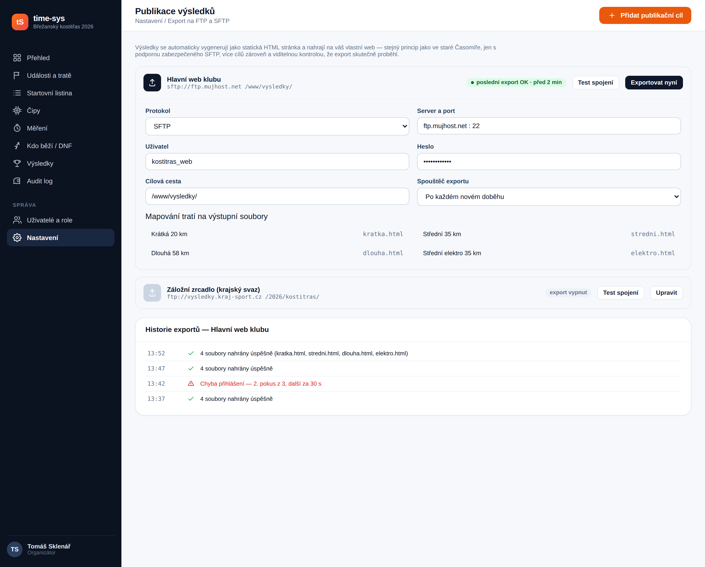
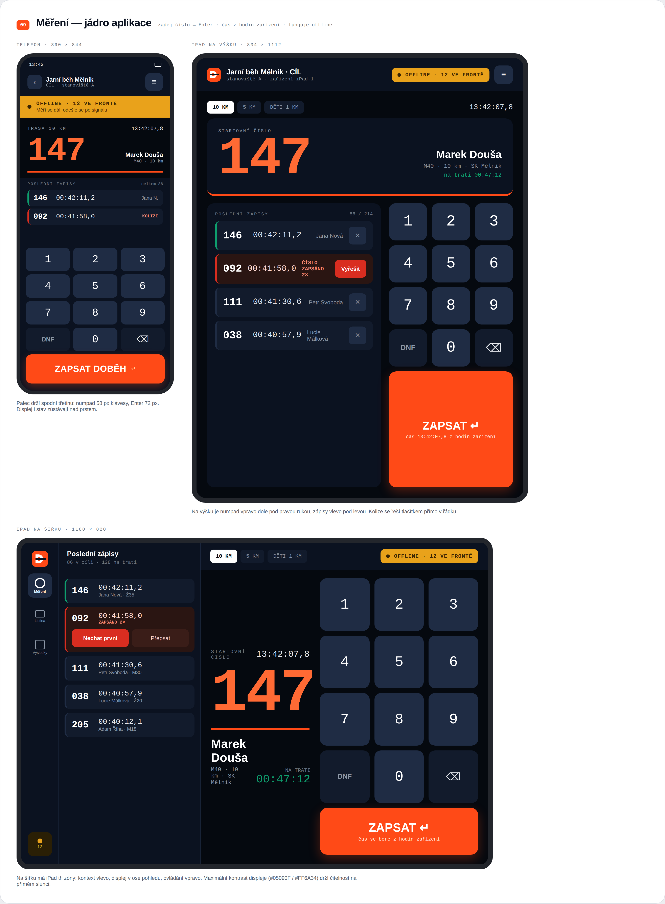
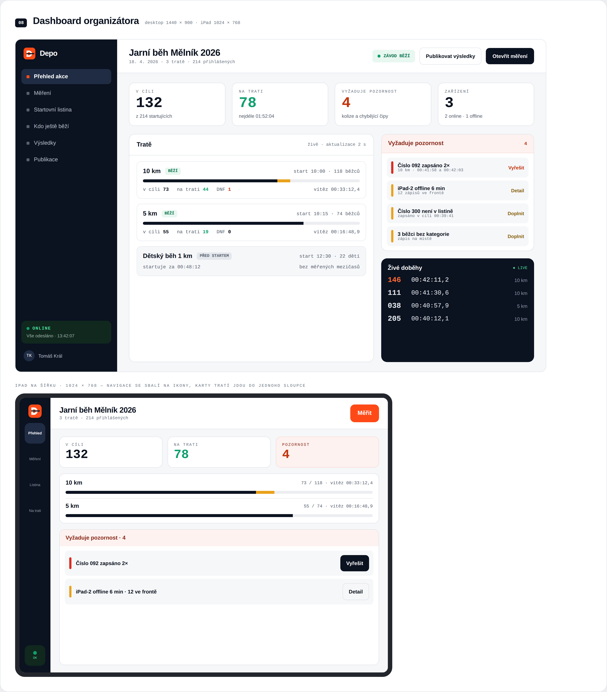
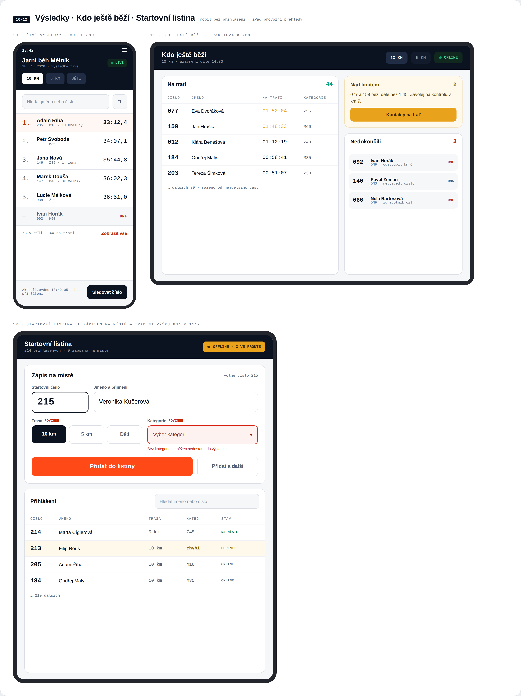
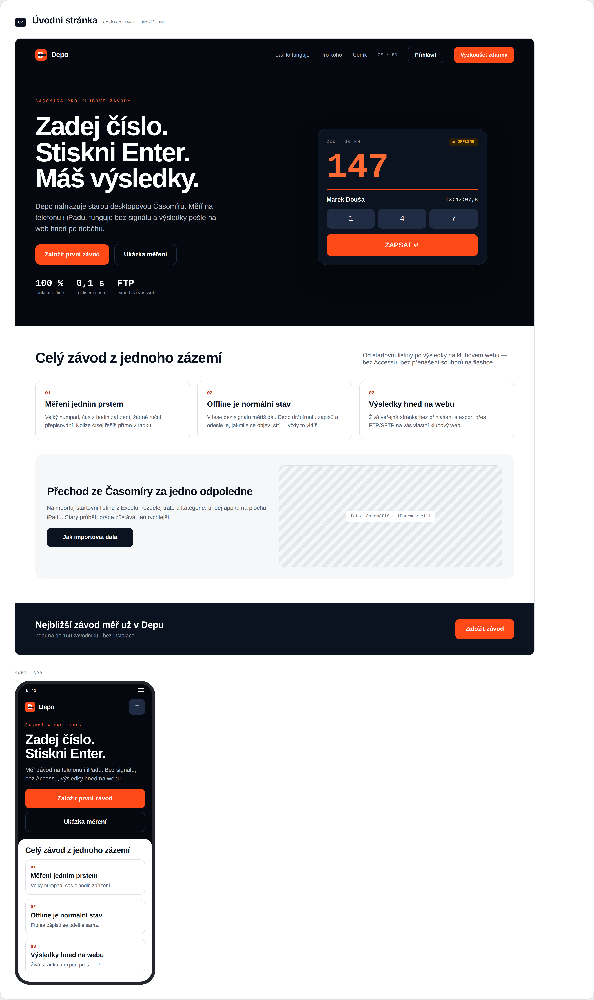
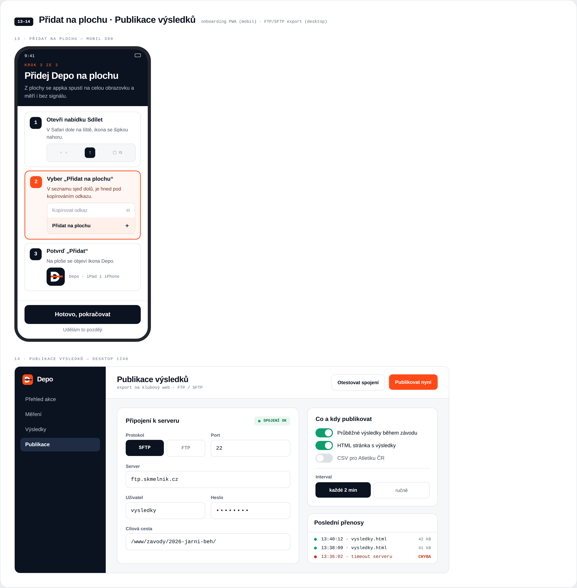

# 7. Návrh obrazovek (UI mockupy)

Statické mockupy klíčových obrazovek nové aplikace — vytvořené jako samostatné HTML/CSS soubory (zdroj v [`/design/mockups`](../design/mockups)) a vyrenderované do PNG přes Playwright/Chromium. Design systém (barvy, typografie, komponenty) je definován v [`shared.css`](../design/mockups/shared.css) a je sdílený napříč všemi obrazovkami pro vizuální konzistenci.

> **Aktualizace:** §7.1–§7.11 níže jsou původní rychlé drátěné mockupy (vlastní iterace, bez finální značky) — zůstávají jako podklad k procesní diskuzi. **§7.12 obsahuje aktuální, propracovanější vizuální směr** s finální značkou Depo, navržený v Claude Design, včetně skutečné responzivity telefon/iPad/desktop (F25). Při rozporu mezi nimi je směrodatné §7.12. Grafická identita (logo, barvy, typografie) je zdokumentovaná v [14-graficka-identita.md](14-graficka-identita.md).

**Design principy:**
- Tmavá postranní navigace (orientace v modulech) + světlý obsah s vysokým kontrastem — čitelnost i na tabletu venku na slunci (N08 v [02-requirements.md](02-requirements.md)).
- `JetBrains Mono` pro všechny číselné/časové údaje (startovní čísla, časy, kódy) — jednoznačná čitelnost číslic pod tlakem.
- Barevná sémantika stavů: zelená = OK/live, oranžová/jantarová = vyžaduje pozornost, červená = kolize/chyba/DNF, modrá = informační.
- Modul Měření má **vlastní, minimalistický tmavý shell** bez postranní navigace — cílem je nulové rozptýlení časoměřiče, obrazovka slouží jedinému účelu.

## 7.1 Přehled organizátora (Dashboard)

Vstupní obrazovka po přihlášení organizátora. Ukazuje stav napříč tratěmi jedné akce, živé doběhy poslední aktivní trati a sekci **„Vyžaduje pozornost“** — přímé promítnutí konceptu `NEEDS_REVIEW` ze synchronizační strategie ([03-architecture.md §3.5](03-architecture.md)) a neresolvovaných zápisů čísla „0“ (viz [01-analysis.md §1.10](01-analysis.md)) do UI, aby organizátor o kolizích/chybách nemusel vědět z technického logu, ale viděl je jako běžnou pracovní frontu.

## 7.2 Nastavení trasy

Nahrazuje formulář „Nastavení“ ze staré Časomíry (F01, F02 v [02-requirements.md](02-requirements.md)). Výběr typu startu jako velké dotykové „pills" (hromadný/vlnový/intervalový), inline editovatelná tabulka kategorií se stejnou strukturou jako reálná `tblVekovaKategorie` (kód, název, pohlaví, ročník od–do — viz [11-legacy-schema-reference.md](11-legacy-schema-reference.md)), postranní panel se startovními vlnami.

## 7.3 Měření — jádro aplikace

**Nejdůležitější obrazovka celého systému** — přímý ekvivalent hlavního formuláře staré Časomíry (UC6, F06). Velký numerický displej zadávaného čísla, numpad optimalizovaný pro rychlé dotykové/klávesnicové zadání, tlačítko **ENTER** zvýrazněné zeleně jako jediná akce, která ukládá čas. Panel „Poslední zápisy“ vpravo dává časoměřiči okamžitou zpětnou vazbu (nově zapsaný záznam zvýrazněn zeleně) — v reálném provozu nahrazuje nutnost se otáčet na "diktujícího" pro kontrolu. Indikátor **offline** v horní liště explicitně komunikuje architektonický princip "žádný zápis se neztratí" (N01, N03 v [02-requirements.md](02-requirements.md)) — natvrdo viditelný stav, ne skrytá technikálie.

## 7.4 Kdo ještě běží / DNF

Živý přehled nahrazující lokální dotaz dostupný dřív jen na jednom počítači (UC10, F10). Sloupec „Postup“ vizualizuje procento uběhnuté trati na základě mezičasů z kontrolních stanovišť — nová funkčnost umožněná síťovou spoluprací stanovišť (viz [03-architecture.md](03-architecture.md)), kterou stará offline-jen architektura neumožňovala v reálném čase.

## 7.5 Živé veřejné výsledky (mobilní pohled)

Veřejná stránka bez nutnosti přihlášení (F16), navržená mobile-first — diváci na startu/cíli i doma sledují výsledky na telefonu. Přepínání tras a kategorií jedním klepnutím, štítek **ŽIVĚ** a časová značka „poslední záznam přijat před X s“ komunikují, že jde o skutečně živá data, ne dávkový export jako ve staré Časomíře.

## 7.6 Audit log

Prohledávatelná a filtrovatelná obdoba starého textového `tblLogy`, ale se strukturovanými sloupci místo volného textu (viz [11-legacy-schema-reference.md §11.2](11-legacy-schema-reference.md)). Sloupec „Typ opravy“ přímo odpovídá číselníku `tblZmenyZaznamu` staré aplikace (originál, přepis nuly na číslo, přepsané číslo…), diff hodnot je vizuálně zvýrazněný (přeškrtnutá stará hodnota → zelená nová), řádek „kolize stanovišť“ ukazuje konkrétní scénář z `NEEDS_REVIEW` stavu.

## 7.7 Uživatelé a role

Nahrazuje "jedno sdílené heslo na tabulku" novým RBAC modelem (F18, F19, [08-security.md](08-security.md)) — pozvánky e-mailem, barevně odlišené role (Admin/Organizátor/Časoměřič/Stanoviště), a veřejný odkaz na živé výsledky včetně QR kódu pro snadné sdílení na místě konání.

## 7.8 Startovní listina

Rychlé zadání na místě (F03) přes formulář nad tabulkou — bez nutnosti otevírat samostatný dialog, optimalizované pro registrační stůl pod tlakem před startem. Vyhledávání a filtrování (F20), tlačítko importu (F04). Automatická kategorizace je komunikována přímo v UI jako vysvětlivka pod formulářem, ne skrytá logika. Pole **Trasa** a **Kategorie** jsou v souladu s aktualizovaným F03 ([02-requirements.md](02-requirements.md)) zvýrazněná jako povinná (oranžový rámeček, hvězdička) — kategorie se sice předvyplní automaticky, ale musí být viditelně potvrzena, nikdy uložena prázdná. Doplněno i nepovinné pole **Nouzový kontakt** (F31).

## 7.9 Párování RFID čipů

Nová obrazovka pro budoucí RFID modul (F22, F29, F30 — viz **[12-rfid-a-doporuceni.md](12-rfid-a-doporuceni.md)** pro detailní návrh). Levý panel simuluje čtečku — po přiložení/naskenování čipu systém ukáže spárovaný záznam (číslo, závodník, trasa, případná vratná záloha) k potvrzení, což odpovídá stejnému principu jako u ručního zápisu: žádná data se neuloží "tiše", uživatel vždy vidí a potvrzuje, co se právě přiřazuje. Pravá tabulka eviduje stavy čipů (`přiřazen`/`záložní`/`ztracen`/`vrácen`) podle životního cyklu popsaného v [04-data-model.md §4.9](04-data-model.md#49-rfid-čip--životní-cyklus), včetně exportu nevrácených čipů/záloh po závodě.

## 7.10 Publikace výsledků (FTP/SFTP export)

Přímá náhrada legacy FTP exportu (F34–F37, viz [12-rfid-a-doporuceni.md](12-rfid-a-doporuceni.md) pro RFID a [03-architecture.md §3.10](03-architecture.md#310-export-a-publikace-výsledků-na-ftpsftp-f34f37) pro tuto funkci). Klíčový rozdíl oproti staré Časomíře: **viditelný stav posledního exportu** (zelený štítek "poslední export OK", historie exportů s chybami a retry) — stará aplikace FTP upload prováděla tiše bez zpětné vazby v UI, takže selhání (např. vypršelé heslo hostingu) organizátor zjistil až při kontrole vlastního webu. Mapování tratí na výstupní soubory (`kratka.html`, `stredni.html`...) odpovídá 1:1 poli `tblZavod.htmlsoubor` ze skutečných dat analyzovaného závodu.

## 7.12 Depo — obrazovky ve finální identitě (Claude Design)

Navrženo na plátně „Depo Aplikace" (zdroj [design/depo-canvas/](../design/depo-canvas/)) — na rozdíl od §7.1–§7.11 už s finální značkou Depo ([14-graficka-identita.md](14-graficka-identita.md)) a explicitně ve **třech velikostech** (telefon / iPad / desktop) pro klíčové obrazovky, podle požadavku F25 v [02-requirements.md](02-requirements.md).

### Měření — jádro aplikace, tři velikosti

Nejdůležitější obrazovka v systému, navržená zvlášť pro každý formát, ne jen škálovaná:
- **Telefon** — numpad a tlačítko dole, kde ho drží palec; displej a stav nad ním mimo dosah prstu.
- **iPad na výšku** — dvousloupcové rozložení, numpad a velké tlačítko „ZAPSAT" vpravo pod pravou rukou, poslední zápisy vlevo pod levou.
- **iPad na šířku** — tři zóny (kontext vlevo, displej uprostřed, ovládání vpravo), maximální kontrast displeje (`#05090F`/`#FF6A34`) pro čitelnost na přímém slunci.

Kolize čísel (stejné číslo zapsáno 2×, viz `NEEDS_REVIEW` v [03-architecture.md §3.5](03-architecture.md)) se řeší přímo v řádku posledních zápisů tlačítkem „Vyřešit"/„Nechat první"/„Přepsat" — bez nutnosti opustit obrazovku měření.

### Dashboard organizátora

Živé počty (v cíli / na trati / vyžaduje pozornost / zařízení), stav tratí s progress barem, sekce „Vyžaduje pozornost" s konkrétní akcí u každé položky (Vyřešit / Detail / Doplnit) — stejný princip jako v §7.1, ale s finální značkou a upřesněnou informační hierarchií. iPad verze sbaluje navigaci na ikony a karty tratí do jednoho sloupce.

### Výsledky · Kdo ještě běží · Startovní listina

- **Živé výsledky (mobil, bez přihlášení)** — vyhledávání podle jména/čísla, tlačítko „Sledovat číslo" pro osobní upozornění.
- **Kdo ještě běží (iPad)** — rozdělení na Na trati / Nad limitem / Nedokončili, s konkrétní akcí („Kontakty na trať") u překročeného limitu — přímé rozšíření F10.
- **Startovní listina se zápisem na místě (iPad na výšku)** — pole **Trasa** a **Kategorie** viditelně označená „POVINNÉ" s vysvětlující hláškou při chybějící hodnotě, přesně podle F03.

### Úvodní stránka (landing page)

Marketingová stránka s jasným sdělením „Zadej číslo. Stiskni Enter. Máš výsledky." a živou ukázkou obrazovky měření přímo v hero sekci. Tři klíčové metriky (100 % funkční offline, 0,1 s rozlišení času, FTP export na váš web) komunikují přesně tři neměnné principy z [01-analysis.md §1.11](01-analysis.md).

### Onboarding „Přidat na plochu" a Publikace výsledků

- **Onboarding (mobil)** — třístupňový vizuální průvodce pro přidání PWA na plochu na iOS (Sdílet → Přidat na plochu → Potvrdit), řeší přímo omezení popsané v [05-tech-stack.md §5.2.1](05-tech-stack.md).
- **Publikace výsledků (desktop)** — přesná realizace F34–F37: volba protokolu (SFTP/FTP), přepínače „co a kdy publikovat" (průběžné výsledky / HTML stránka / CSV pro Atletiku ČR — nový nápad nad rámec zadání, viz níže), interval nebo ruční spuštění, a **historie posledních přenosů se stavem** (úspěch/chyba) — přesně řeší nedostatek staré Časomíry popsaný v [03-architecture.md §3.10](03-architecture.md#310-export-a-publikace-výsledků-na-ftpsftp-f34f37) (tichý neúspěch bez zpětné vazby v UI).

> **Nový nápad zachycený v návrhu:** přepínač „CSV pro Atletiku ČR" naznačuje export do formátu národního svazu/žebříčku — nebyl zatím v žádném dokumentu explicitně požadovaný, ale je to rozumné doplnění F34 pro atletické oddíly. Navrhuji zvážit jako **F43** ve Fázi 4, pokud o to bude zájem konkrétních klubů.

## 7.13 Zdrojové soubory

| Soubor | Popis |
|---|---|
| [`design/mockups/shared.css`](../design/mockups/shared.css) | Sdílený design systém (barvy, typografie, komponenty) |
| [`design/mockups/_icons.html`](../design/mockups/_icons.html) | Sada inline SVG ikon (sprite) |
| [`design/mockups/01-dashboard.html`](../design/mockups/01-dashboard.html) … `10-publikace-vysledku.html` | Zdrojový HTML kód jednotlivých obrazovek (§7.1–§7.11) |
| [`design/depo-canvas/`](../design/depo-canvas/) | Zdrojová Claude Design plátna „Depo Identita" a „Depo Aplikace" (§7.12, [14-graficka-identita.md](14-graficka-identita.md)) |
| [`design/brand/`](../design/brand/) | Vektorové SVG logo Depo |

Mockupy v §7.1–§7.11 slouží jako vizuální podklad pro diskuzi s uživatelem/organizátorem, ne jako finální UI specifikace. §7.12 s finální značkou je aktuálnější směr, ale i ten se očekávaně dál upřesní ve Fázi 1 (viz [10-roadmap.md](10-roadmap.md)).
