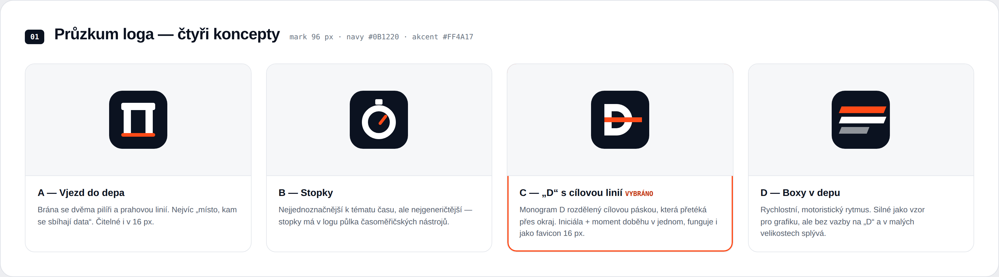
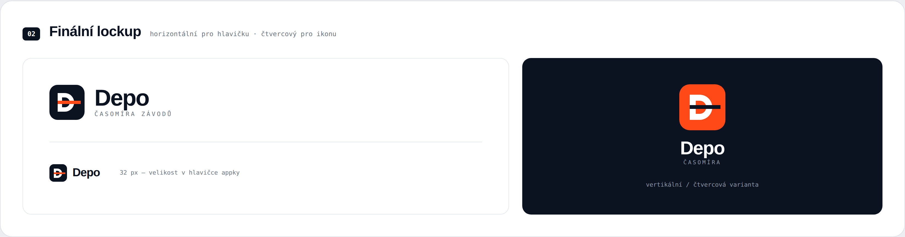
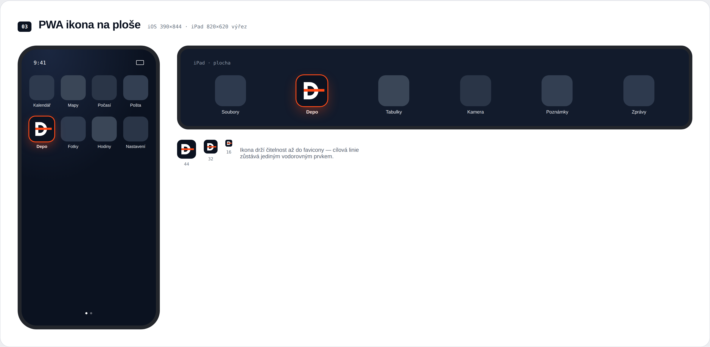
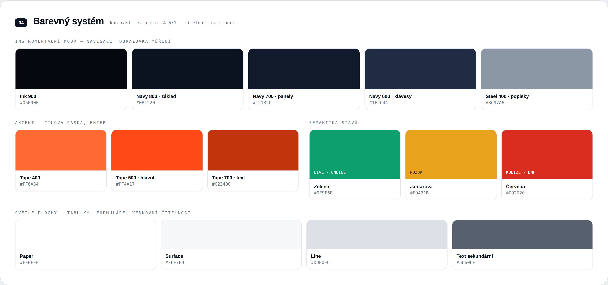
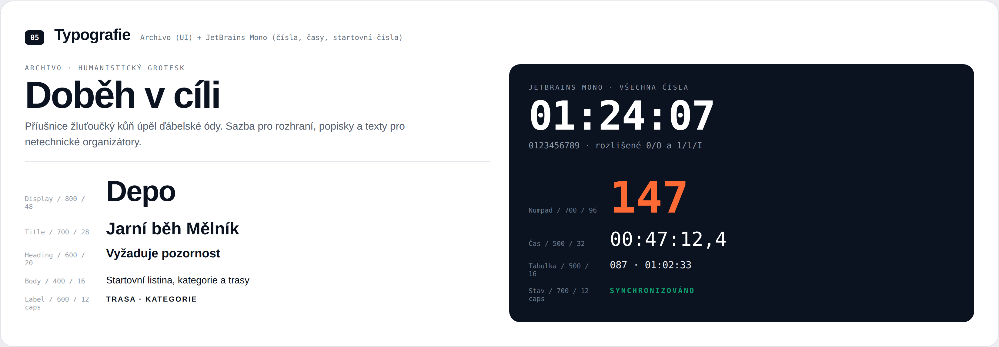
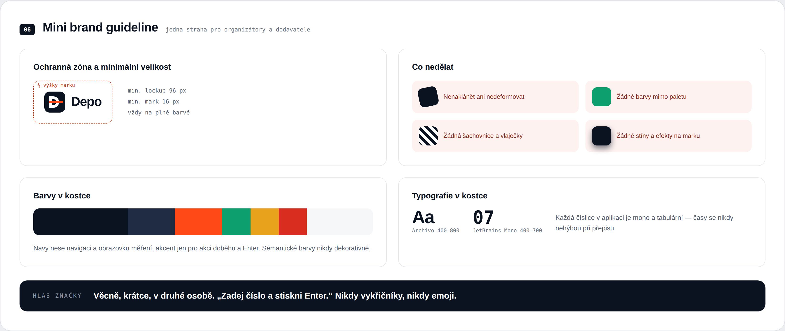

# 14. Grafická identita — Depo

Vizuální identita a klíčové obrazovky navržené v Claude Design (plátna „Depo Identita" a „Depo Aplikace"). Zdrojové `.dc.html` soubory jsou v [`design/depo-canvas/`](../design/depo-canvas/), vektorové logo v [`design/brand/`](../design/brand/), tento dokument shrnuje obsah pro rychlou orientaci a jako referenci pro implementaci.

> Vztah k dřívějším mockupům: `docs/07-ui-mockups.md` obsahuje 10 dřívějších drátěných HTML mockupů (vlastní rychlá iterace bez finální značky). Tento dokument a plátno „Depo Aplikace" je **aktuální, propracovanější vizuální směr** se skutečnou značkou Depo — při rozporu mezi oběma je směrodatný tento dokument a `design/depo-canvas/Depo Aplikace.dc.html`.

## 14.1 Logo

Čtyři prozkoumané koncepty, vybrána varianta **C — „D" s cílovou linií**: monogram D (iniciála Depo) rozdělený vodorovným pruhem evokujícím cílovou pásku/moment doběhu. Funguje i ve velmi malé velikosti (favicon 16 px), protože jde jen o dva jednoduché tvary (D + pruh), ne detailní kresbu.

Zamítnuté varianty a proč: **A — Vjezd do depa** (brána/vjezd, nejvíc doslovná k názvu, ale míň čitelná v 16 px), **B — Stopky** (nejjednoznačnější k tématu času, ale nejgeneričtější — půlka časoměřičských nástrojů má stopky v logu), **D — Boxy v depu** (rychlostní/motoristický rytmus, silný jako grafický vzor, ale bez vazby na písmeno „D" a v malých velikostech splývá).

Dvě oficiální varianty:
- **Horizontální lockup** (značka + „Depo" + podtitulek "ČASOMÍRA ZÁVODŮ") — pro hlavičku aplikace a marketing.
- **Vertikální/čtvercová varianta** (značka nad nápisem, tmavé pozadí) — pro úvodní/splash obrazovky.

Značka samotná ve 32 px (velikost v hlavičce appky) zůstává čitelná — to byl jeden z požadavků na výběr konceptu.

Pro instalovanou PWA ikonu (viz F25, N08 v [02-requirements.md](02-requirements.md) — telefon i iPad) se používá **oranžová (Tape 500) varianta** místo navy — vyšší kontrast a rozpoznatelnost mezi ostatními ikonami na ploše telefonu/iPadu. Ikona drží čitelnost až do velikosti favicony, protože cílová linie zůstává jedním souvislým vodorovným prvkem i při zmenšení.

### Vektorové soubory (SVG)

K dispozici v [`design/brand/`](../design/brand/), zrekonstruované jako skutečné vektory (ne rastrový export) z přesné geometrie navržené na plátně — bezztrátově škálovatelné pro favicon, app ikonu, tisk i README:

| Soubor | Použití |
|---|---|
| [`depo-mark.svg`](../design/brand/depo-mark.svg) | Primární značka — navy pozadí, bílé D, oranžový pruh |
| [`depo-mark-appicon.svg`](../design/brand/depo-mark-appicon.svg) | PWA/app ikona — oranžové pozadí (vyšší kontrast na ploše telefonu) |
| [`depo-mark-mono-white.svg`](../design/brand/depo-mark-mono-white.svg) | Jednobarevná bílá, transparentní pozadí — pro tmavé podklady |
| [`depo-mark-mono-black.svg`](../design/brand/depo-mark-mono-black.svg) | Jednobarevná tmavá, transparentní pozadí — pro světlé podklady a tisk |
| [`depo-logo-horizontal.svg`](../design/brand/depo-logo-horizontal.svg) | Horizontální lockup se nápisem „Depo" pro hlavičku aplikace |

## 14.2 Barevný systém

| Token | HEX | Použití |
|---|---|---|
| Ink 900 | `#05090F` | Nejtmavší — hluboké pozadí, kontrastní akcenty |
| Navy 800 · základ | `#0B1220` | Základní tmavé pozadí (sidebar, obrazovka Měření) |
| Navy 700 · panely | `#121B2C` | Panely a karty na tmavém pozadí |
| Navy 600 · klávesy | `#1F2C44` | Interaktivní prvky na tmavém (klávesy numpadu) |
| Steel 400 · popisky | `#8C97A6` | Sekundární text na tmavém pozadí |
| Tape 400 | `#FF6A34` | Akcent, světlejší odstín |
| Tape 500 · hlavní | `#FF4A17` | **Primární akcent** — cílová páska, tlačítko Enter/Zapsat |
| Tape 700 · text | `#C2340C` | Akcentový text (odkazy, zvýraznění) |
| Zelená | `#0E9F6E` | Stav „live"/„online" |
| Jantarová | `#E9A21B` | Stav „vyžaduje pozornost" |
| Červená | `#D92D20` | Stav „kolize"/„DNF" |
| Paper | `#FFFFFF` | Bílé plochy, karty na světlém |
| Surface | `#F6F7F9` | Pozadí obsahu na světlém |
| Line | `#DDE0E6` | Linky a ohraničení |
| Text sekundární | `#56606E` | Sekundární text na světlém pozadí |

Požadovaný kontrast textu min. 4,5:1 — explicitně navrženo pro čitelnost venku na slunci (N08 v [02-requirements.md](02-requirements.md)). Sémantické barvy (zelená/jantarová/červená) se používají **výhradně pro stav**, nikdy dekorativně — stejné pravidlo je zapsané v mini brand guideline (§14.4).

> Pozn.: tyto tóny jsou blízké, ale nejsou identické s pracovní paletou v `design/mockups/shared.css` (dřívější rychlé mockupy, např. tamní `--navy-950:#0b1220` odpovídá zde „Navy 800 · základ"). Při přechodu do kódu (Fáze 1) by se `shared.css`/design tokeny frontendu měly sjednotit na tuto oficiální paletu, ne na tu dřívější provizorní.

## 14.3 Typografie

- **Archivo** (humanistický grotesk) — veškerý UI text, nadpisy, popisky. Váhy 400–800.
- **JetBrains Mono** — **všechna čísla, časy a startovní čísla**, bez výjimky. Rozlišuje 0/O a 1/l, tabulkové (stejnoširoké) číslice, aby se čísla v tabulkách nikdy neposouvala. Toto pravidlo je v mini brand guideline zapsané jako závazné: *„Každé číslo v aplikaci je mono a v tabulkách — časy se nikdy nepřepisují."*

## 14.4 Mini brand guideline

Shrnutí pro organizátory a dodavatele (např. při zadání tisku startovních čísel nebo bannerů):

- **Ochranná zóna a minimální velikost:** min. lockup 96 px, min. samotná značka 16 px, vždy na plné barvě (nikdy nezeslabovat/nepolopropustňovat).
- **Co nedělat:** neaplikovat gradient/nedeformovat značku, nepoužívat barvy mimo paletu, nepřidávat šachovnici/vlaječky (klišé, se kterým se identita vědomě vymezuje, stejně jako v konkurenční analýze [13-konkurencni-analyza.md](13-konkurencni-analyza.md)), nepřidávat vlastní stíny/efekty na značku.
- **Hlas značky:** *„Věcně, krátce, v druhém osobě. „Zadej číslo a stiskni Enter." Nikdy vykřičníky, nikdy emoji."* — přímo odpovídá principu jednoduchosti jádrového workflow (F06 v [02-requirements.md](02-requirements.md)).

## 14.5 Odkazy na navazující dokumenty

- Klíčové obrazovky aplikace v nové identitě: [07-ui-mockups.md §7.12](07-ui-mockups.md) (nová sekce s obrazovkami z „Depo Aplikace").
- Zdrojová plátna: [design/depo-canvas/](../design/depo-canvas/).
- Vektorové logo: [design/brand/](../design/brand/).
