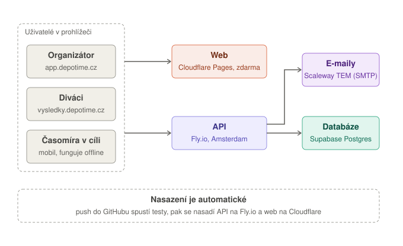
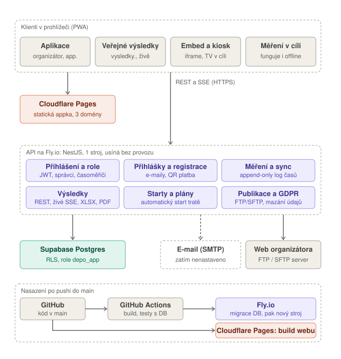

# 16. Přehled infrastruktury Depo

Stručný přehled pro orientaci (technické podrobnosti nasazení jsou v [15-produkcni-nasazeni.md](15-produkcni-nasazeni.md)).

## 16.1 Základní přehled

- **Uživatelé** (organizátor, diváci, časoměřič v cíli) používají Depo v prohlížeči.
- **Web** (to, co vidí v prohlížeči) je statická appka na **Cloudflare Pages** — zdarma, žádný běžící server.
- **API** je program na **Fly.io** (Amsterdam) — dělá veškerou práci s daty.
- **Databáze** je **Supabase** (spravovaný PostgreSQL) — tam jsou uložená všechna data.
- **Nasazení** je automatické: push do GitHubu spustí testy, pak se nasadí API na Fly.io a web na Cloudflare.

## 16.2 Podrobný přehled

- **Klienti:** aplikace organizátora (`app.depotime.cz`), veřejné výsledky (`vysledky.depotime.cz`), embed (iframe) a kiosk, měření v cíli (funguje i offline díky frontě v prohlížeči). Jeden a ten samý build webu se servíruje na třech doménách (`depotime.cz`, `app.`, `vysledky.`).
- **API na Fly.io** (NestJS) se skládá z modulů: přihlášení a role (JWT), přihlášky a registrace (e-maily, QR platba), měření a synchronizace (append-only log časů), výsledky (REST, živé SSE, export XLSX/PDF), starty a plány (automatický start tratě) a publikace na FTP/SFTP s mazáním údajů podle GDPR.
- **Supabase Postgres:** aplikace se připojuje neprivilegovanou rolí `depo_app` (kvůli Row-Level Security).
- **E-mail (SMTP):** kód je hotový, ale na produkci zatím **není nastavený** (žádné `SMTP_*` secrets), takže se e-maily neodesílají.
- **Web organizátora:** Depo umí výsledky automaticky nahrávat na FTP/SFTP server organizátora.
- **Nasazení:** GitHub Actions spustí build a testy (včetně testovací databáze). Fly.io pak před spuštěním nového stroje provede migraci databáze (`release_command`). Cloudflare Pages si web buduje samo přímo z GitHubu.

## 16.3 K čemu je Fly.io (laicky)

Cloudflare je **výloha** (vzhled appky), Fly.io je **obchod za ní** (ověřuje přihlášení, přijímá a počítá časy, posílá výsledky živě, e-maily a exporty, spouští plánované starty) a Supabase je **sklad** (databáze). Prohlížeč sám nic nepočítá ani neukládá, vždy se zeptá API na Fly.io, a to si vezme data z databáze. Bez Fly.io by se nešlo přihlásit, zapsat čas ani zobrazit výsledky.

## 16.4 Důležité vlastnosti provozu

- **Jedna instance API.** Živé výsledky (SSE) běží v paměti jednoho procesu, víc instancí by si zprávy nepředávalo (viz [§15.4](15-produkcni-nasazeni.md#154-kolik-instancí-api-přesně-jedna)).
- **Stroj na Fly.io se bez provozu vypíná** (`auto_stop_machines = 'stop'`, `min_machines_running = 0` ve [fly.toml](../fly.toml)). První požadavek po pauze čeká několik sekund na nastartování. Při závodě je vhodné nastavit `min_machines_running = 1`.
- **Cena Fly.io:** stroj `shared-cpu-1x` s 256 MB stojí při nepřetržitém provozu orientačně 2 USD měsíčně (aktuální ceník: fly.io/docs/about/pricing). Databáze Supabase se účtuje zvlášť.
- **Supabase nenahrazuje Fly.io.** Supabase umí databázi, přihlašování, úložiště souborů a krátké serverless funkce (Edge Functions), ale nehostuje dlouho běžící server ani Docker kontejner. Depo API (NestJS s živým SSE a plánovanými úlohami) proto běží na Fly.io. Přesun na Supabase by znamenal přepsat API.
